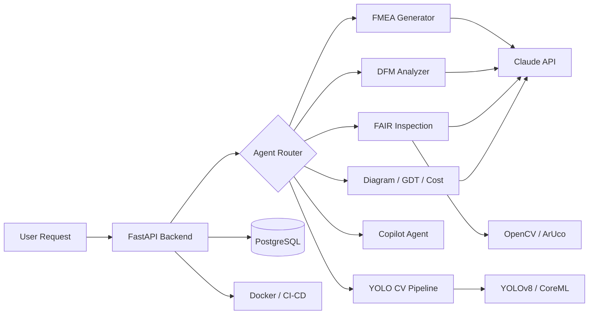
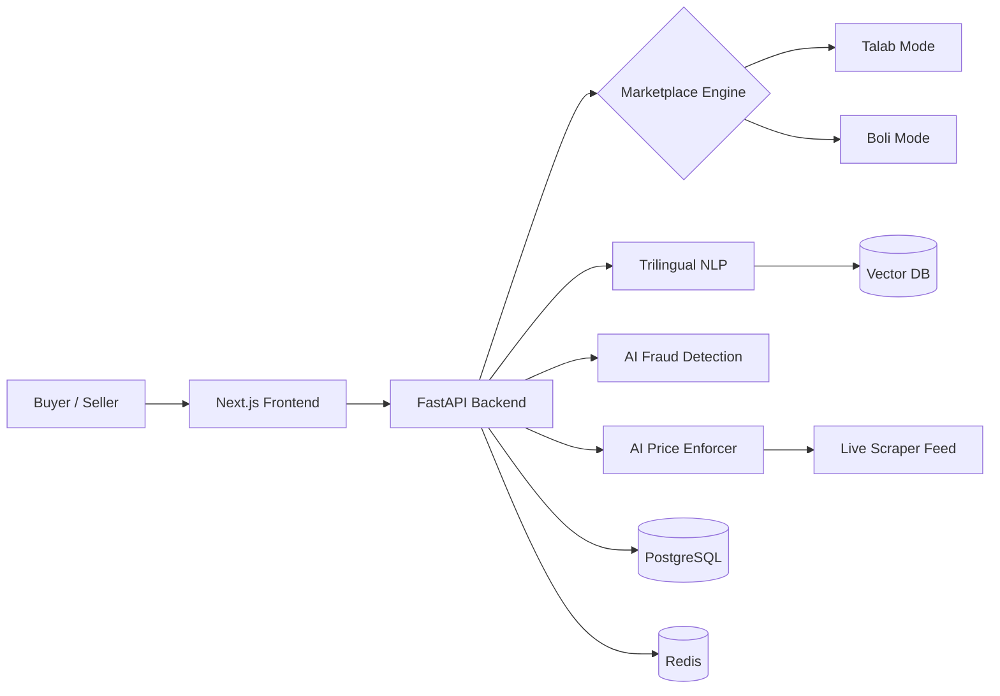
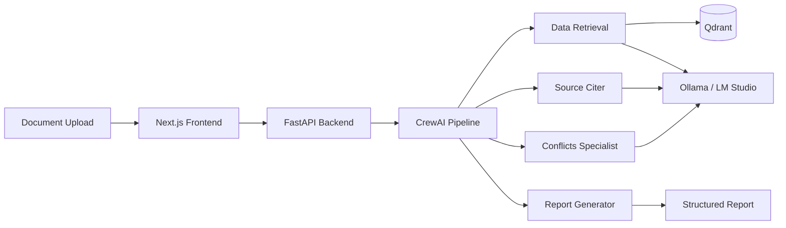
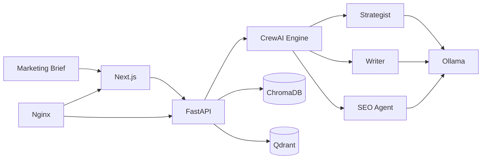
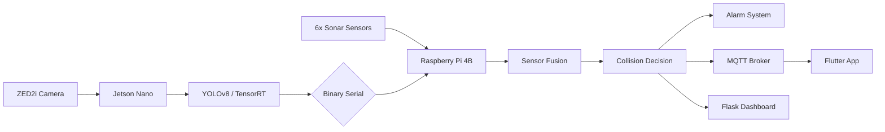
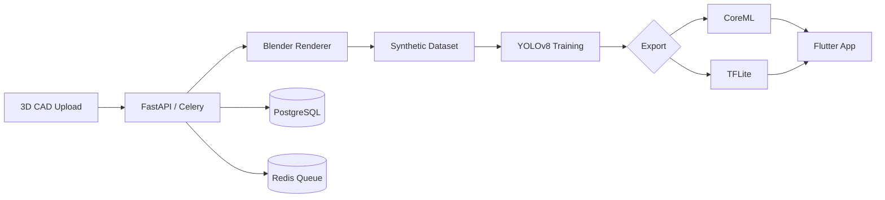
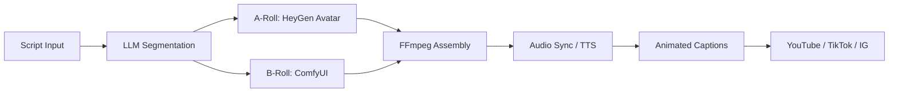

*I design APIs, architect multi-agent systems, and deploy production automation — not wrappers, not prototypes.*

[About Me](#-about-me) · [Tech Stack](#-tech-stack) · [Featured Projects](#-featured-projects) · [GitHub Stats](#-github-stats) · [Hire Me](#-open-to-opportunities)

---

## 🚀 About Me

**Senior Python Engineer** with **7+ years** shipping production systems across **AI agents, API development, automation, and data engineering**. MS in Manufacturing Engineering from UET Lahore.

- 🏗️ **Founded [OhmFrame AI](https://ohmframe.com)** — live engineering AI platform with 5 production agents powered by Claude API
- 🤖 **AI Agent Architect** — multi-agent pipelines with CrewAI, LangChain, RAG, and vector search (Qdrant/ChromaDB)
- 🔌 **API Developer** — FastAPI/Flask backends with OAuth2, WebSocket, async job queues — I build APIs, not wrap them
- 👁️ **Computer Vision** — YOLOv8 + TensorRT on Jetson Nano, ZED2i stereo depth, ultrasonic sensor fusion
- ⚡ **Automation** — Selenium/Playwright with proxy rotation, anti-bot handling, and 24/7 unattended operation
- 📍 Based in **Lahore, Pakistan** · Open to **remote worldwide** · Global exposure across 10+ countries

---

## 🛠️ Tech Stack

---

## 📌 Featured Projects

### 🧠 [OhmFrame AI](https://ohmframe.com) — Engineering AI Platform `LIVE`
> **5 production autonomous agents** built on **Claude API** serving hardware startups: FMEA Generator, DFM Analyzer, FAIR Inspection (OpenCV, ±1mm accuracy), YOLO CV pipeline (Blender → CoreML → iOS), and a Tauri desktop Copilot. Plus AI-powered diagram generation, tolerance stackup, cost estimation, and patent search.

> `Python` `FastAPI` `Claude API` `OpenCV` `YOLOv8` `Tauri` `Rust` `Docker` `PostgreSQL` `Next.js`

---

### 🛒 Bolee — AI-First Classifieds Marketplace `MVP DELIVERED`
> Dual-mode marketplace: **Talab Mode** (reverse — buyers post demand, sellers compete) and **Boli Mode** (real-time auction). Trilingual NLP search (English, Urdu, Roman Urdu) via vector embeddings. AI fraud detection on every listing. AI price enforcement anchored by live scraper data. Escrow-backed transactions with CNIC identity tiers.

> `Python` `FastAPI` `Next.js` `PostgreSQL` `Redis` `Vector DB` `OpenAI` `NLP` `Selenium` `Docker`

---

### 📄 [ContractForge](https://github.com/dawarazhar11/contract-forge) — Multi-Agent Contract Analysis
> **4 specialized CrewAI agents**: Data Retrieval (semantic vector search), Source Citer, Conflicts Specialist (cross-contract contradiction detection), and Report Generator. Fully local AI with WebSocket real-time progress. Supports PDF, DOC, DOCX, TXT.

> `Python` `CrewAI` `FastAPI` `WebSocket` `Qdrant` `Next.js` `Ollama` `Docker`

---

### 📢 [CrewAI Nexus](https://github.com/dawarazhar11/crewai-nexus) — Local AI Content Marketing
> Fully containerized multi-agent system running **100% offline**. Strategist, Writer, and SEO agents with capability-based model selection. ChromaDB + Qdrant vector search. Docker orchestrated with Nginx reverse proxy.

> `Python` `CrewAI` `FastAPI` `Ollama` `ChromaDB` `Qdrant` `Docker Compose` `Nginx`

---

### 🚗 GoViz — Industrial Collision Detection `DELIVERED`
> Dual-device embedded system: **Jetson Nano** (YOLOv8 + TensorRT, 10-15 FPS, ZED2i stereo depth) communicates via custom binary serial to **Raspberry Pi 4B** (6-zone ultrasonic sensor fusion, alarm triggering). MQTT mobile control, Flask/Socket.IO dashboard. Systemd for **24/7 unattended operation**.

> `Python` `YOLOv8` `TensorRT` `ZED2i` `Raspberry Pi` `MQTT` `Flask` `Socket.IO` `Flutter`

---

### 👁️ [VisionForge](https://github.com/dawarazhar11/VisionForge) — 3D-to-Mobile YOLO Pipeline
> Upload 3D assemblies → Blender EEVEE synthetic data (randomized angles + lighting) → YOLOv8 GPU training → export CoreML (iOS) + TFLite (Android) → Flutter app at **30+ FPS**. RESTful API with Celery async job processing.

> `Python` `FastAPI` `Celery` `Redis` `PostgreSQL` `Blender` `YOLOv8` `CoreML` `TFLite` `Flutter`

---

### 🎬 [ReelForge](https://github.com/dawarazhar11/ReelForge) — AI Video Automation `95 COMMITS`
> LLM-powered script segmentation into A-Roll/B-Roll → ComfyUI or Replicate for visuals → HeyGen avatar talking-head → FFmpeg assembly with audio sync → animated captions → auto-publish to **YouTube, TikTok, Instagram**.

> `Python` `Streamlit` `Ollama` `ComfyUI` `HeyGen API` `FFmpeg` `TTS`

---

### 🗣️ [SolidVoice](https://github.com/dawarazhar11/SolidVoice-Voice-Enabled-Parametric-Modelling-in-SolidWorks) — Voice-Controlled CAD Agent ⭐ 8
> Voice command → Whisper STT → LLM intent parsing → autonomous SolidWorks sketch execution via COM API. Vector memory with Qdrant + Nomic. Rust desktop UI.

> `Python` `OpenAI` `Claude API` `Whisper` `Qdrant` `Rust` `SolidWorks COM API`

---

### 🕷️ [AI Product & Price Scraper](https://github.com/dawarazhar11/AI-Product-and-Price-Scrapper) — Production Data Feed `LIVE`
> Dual-engine (Selenium + Playwright) with proxy rotation, exponential backoff, and structured logging. Runs unattended 24/7 feeding real-time pricing into Bolee's AI price enforcement.

> `Python` `Selenium` `Playwright` `BeautifulSoup` `PostgreSQL` `asyncio`

---

<b>More Projects</b> — Manufacturing AI, CAD Tools, Infrastructure

 

| Project | Description | Tech |
|---------|-------------|------|
| 🔧 [PartForge PLM](https://github.com/dawarazhar11/partforge-plm) | Standardized part number management — CLI + web UI | Next.js, TypeScript, Zod |
| ✏️ [OhmFrame Drawer](https://github.com/dawarazhar11/ohmframe-drawer) | AI 2D drawing generator from STEP files | TypeScript, CAD Automation |
| 🔍 [FAIR Inspection Agent](https://github.com/dawarazhar11/fair-inspection-agent) | ArUco-based part inspection, ±1mm accuracy | Python, OpenCV |
| 🏭 [VLM-CAD Recognition](https://github.com/dawarazhar11/VLM-CADFeatureRecognition) | Manufacturing feature detection via VLMs | Python, VLMs, Jupyter |
| 🐳 [Blender Docker Headless](https://github.com/dawarazhar11/blender-docker-headless) | GPU render farm — Blender 5.0, CUDA 12.4 | Python, Docker, CUDA |
| ⚡ Enterprise Data Pipelines | Scalable ETL/ELT with scheduling and monitoring | Airflow, dbt, Snowflake |

---

## 📊 GitHub Stats

&nbsp;&nbsp;

  

  

---

### 💼 Open to Opportunities

**AI Engineering · Python Development · Automation · Data Engineering**

95+ repos · 364+ stars · 7+ years shipping production systems · MS Manufacturing Engineering (UET Lahore)

 

 

*"I build systems that work in the real world, not just in notebooks."*

