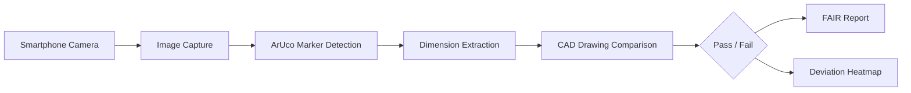
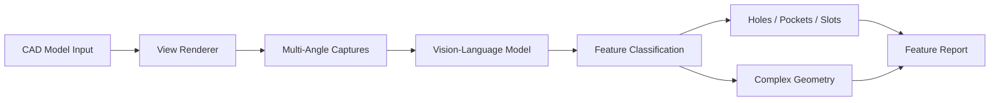
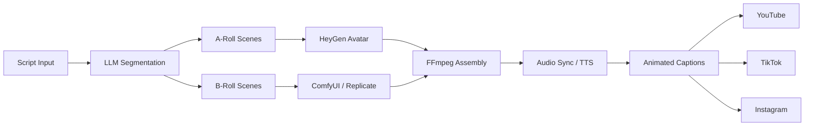
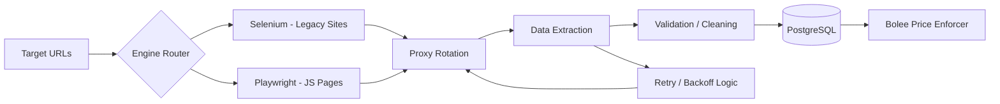
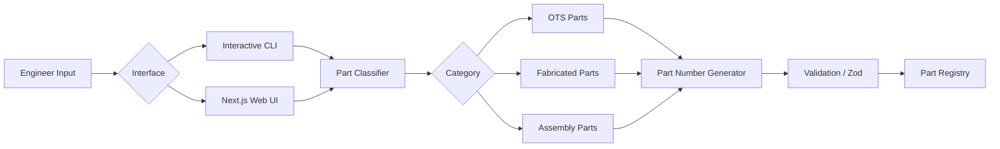
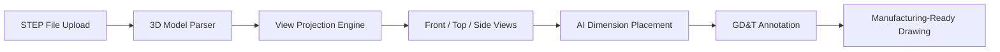
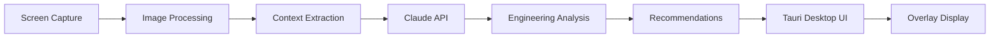
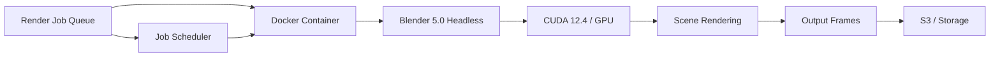

<div align="center">


<br/>

*I design APIs, architect multi-agent systems, and deploy production automation — not wrappers, not prototypes.*

<br/>

[](https://www.linkedin.com/in/dawarazhar/)
[](https://ohmframe.com)
[](https://github.com/dawarazhar11)
[](mailto:dawarazhar11@gmail.com)

</div>

---

<div align="center">

### Quick Navigation

[About Me](#-about-me) · [Tech Stack](#-core-tech-stack) · [AI Agent Projects](#-ai-agent-systems) · [Computer Vision](#-computer-vision--edge-ai) · [Automation](#-automation--scraping) · [Manufacturing AI](#-manufacturing-ai--cad) · [Data Engineering](#-data-engineering) · [GitHub Stats](#-github-stats) · [Highlights](#-career-highlights) · [Hire Me](#-open-to-opportunities)

</div>

---

## 🧠 What I Do

```python
class DawarAzhar:
    role     = "Senior Python & AI Engineer"
    exp      = "7+ years"
    company  = "OhmFrame AI (Founder)"
    edu      = "MS Manufacturing Engineering — UET Lahore"

    backend_apis = {
        "frameworks":    ["FastAPI", "Flask", "Socket.IO", "Node.js"],
        "patterns":      ["REST", "WebSocket", "OAuth2", "Webhooks", "Event-Driven"],
        "async":         ["asyncio", "aiohttp", "Celery", "Redis queues"],
        "auth_payments": ["OAuth2", "JWT", "Escrow systems", "Identity verification"],
    }

    ai_agents = {
        "orchestration": ["LangChain", "CrewAI", "Multi-Agent Pipelines"],
        "llms":          ["OpenAI GPT-4", "Claude API", "Ollama", "LM Studio"],
        "retrieval":     ["RAG", "Qdrant", "ChromaDB", "Vector Embeddings"],
    }

    databases = {
        "relational":    ["PostgreSQL", "MySQL", "SQLite"],
        "nosql":         ["MongoDB", "Redis"],
        "vector":        ["Qdrant", "ChromaDB"],
        "warehousing":   ["Snowflake", "dbt", "ETL/ELT Pipelines"],
    }

    automation = ["Selenium", "Playwright", "Airflow", "Scrapy", "Anti-bot handling"]
    cv_ml      = ["YOLOv8", "OpenCV", "TensorRT", "Edge AI", "VLMs", "Synthetic Data"]
    devops     = ["Docker", "AWS (EC2/S3/Lambda)", "GitHub Actions", "CI/CD", "systemd"]
    embedded   = ["Raspberry Pi GPIO", "NVIDIA Jetson", "MQTT", "Sensor Fusion", "CUDA"]

    def current_focus(self):
        return "Building autonomous AI agents that replace manual workflows at scale"
```

---

## 🚀 About Me

**Senior Python Engineer** with **7+ years** shipping production systems across **AI agents, API development, automation, and data engineering**.

I don't wrap APIs — I design, build, and deploy them from scratch. FastAPI backends with auth, async job processing, WebSocket real-time streaming, structured logging, and production-grade error handling.

- 🏗️ **Founded [OhmFrame AI](https://ohmframe.com)** — live engineering AI platform with **5 production agents** powered by Claude API, serving hardware startups
- 🤖 **AI Agent Architect** — multi-agent pipelines with CrewAI, LangChain, RAG, and vector search
- 🔌 **API Developer** — FastAPI/Flask backends with OAuth2, WebSocket, event-driven architectures, and async job queues
- 🗄️ **Database Engineer** — PostgreSQL schema design, vector DBs (Qdrant/ChromaDB), Redis caching, Snowflake warehousing
- ⚡ **Automation** — Selenium/Playwright with proxy rotation, anti-bot handling, and unattended 24/7 operation
- 👁️ **Computer Vision** — YOLOv8 + TensorRT on Jetson Nano, ZED2i stereo depth, ultrasonic sensor fusion
- 🌍 **Global exposure** across USA, UK, Germany, France, Canada, China, Australia, and more
- 📍 Based in **Lahore, Pakistan** · Open to **remote opportunities worldwide**

---

## 🛠️ Core Tech Stack

<div align="center">

**Python & Backend**


**AI Agents & LLMs**


**Databases**


**Computer Vision & ML**


**Automation & Scraping**


**Cloud & DevOps**


**Edge & Embedded**


</div>

---


## 📌 AI Agent Systems


### 🧠 [OhmFrame AI](https://ohmframe.com) — Engineering AI Platform `LIVE`
> Full-stack AI-powered engineering platform serving hardware startups (EV chargers, battery systems, datacenter power). **5 production autonomous agents** built on **Claude API**: FMEA Generator (auto-generates failure modes with severity/occurrence/detection ratings), DFM Analyzer (real-time manufacturability feedback), FAIR Inspection Agent (ArUco + OpenCV, ±1mm accuracy), YOLO CV Detection pipeline (Blender → PyTorch → CoreML → iOS), and OhmFrame Copilot desktop agent (Tauri + Rust). Additional AI tools include technical diagram generation, tolerance stackup analysis, GD&T advisor, material selector, cost estimation, and patent search.


> `Python` `FastAPI` `Claude API` `OpenCV` `YOLOv8` `Tauri` `Docker` `GitHub Actions` `PostgreSQL` `Next.js`

---

### 📄 [ContractForge](https://github.com/dawarazhar11/contract-forge) — Multi-Agent Contract Analysis
> **4 specialized CrewAI agents** in pipeline: Data Retrieval Specialist (semantic vector search via Qdrant), Source Citer (section-level citation), Conflicts of Interest Specialist (cross-contract contradiction detection), and Report Generator. Fully local AI with **WebSocket real-time progress tracking**. Supports PDF, DOC, DOCX, TXT.


> `Python` `CrewAI` `FastAPI` `WebSocket` `Qdrant` `Next.js` `Ollama` `LM Studio` `Docker`

---

### 📢 [CrewAI Nexus](https://github.com/dawarazhar11/crewai-nexus) — Local AI Content Marketing Platform
> Fully containerized multi-agent content marketing system running **100% offline**. Capability-based model selection, real-time job tracking, semantic vector search with ChromaDB and Qdrant, web search via OpenSerp. Docker orchestrated with **Nginx reverse proxy**.


> `Python` `CrewAI` `FastAPI` `Next.js` `Ollama` `ChromaDB` `Qdrant` `Docker Compose` `Nginx`

---

### 🗣️ [SolidVoice](https://github.com/dawarazhar11/SolidVoice-Voice-Enabled-Parametric-Modelling-in-SolidWorks) — Voice-Controlled CAD Agent ⭐ 8
> Event-driven agent: voice command → LLM prompt generation → autonomous CAD sketch execution inside SolidWorks via system-level COM API. Intelligent voice-controlled parametric modelling with vector memory (Qdrant + Nomic) and native Rust desktop UI.


> `Python` `OpenAI` `Claude API` `Whisper` `Qdrant` `Nomic` `Rust` `SolidWorks COM API`

---


## 👁️ Computer Vision & Edge AI


### 🚗 GoViz — Industrial Collision Detection `DELIVERED`
> Dual-device embedded system: **Jetson Nano** runs YOLOv8 + TensorRT (10-15 FPS) with ZED2i stereo depth camera; **Raspberry Pi 4B** fuses vision data with 6-zone HC-SR04 ultrasonic sensors for collision decisions and alarm triggering. Custom binary serial protocol between devices. MQTT-based Flutter mobile control app. Systemd deployment for **24/7 unattended operation**.


> `Python` `YOLOv8` `TensorRT` `ZED2i` `Raspberry Pi GPIO` `MQTT` `Flask` `Socket.IO` `Flutter` `systemd`

---

### 👁️ [VisionForge](https://github.com/dawarazhar11/VisionForge) — 3D-to-Mobile YOLO Pipeline
> End-to-end: upload 3D assembly files → generate synthetic training data via Blender EEVEE (randomized camera angles + lighting) → train YOLO segmentation models with GPU → export to CoreML (iOS) and TFLite (Android) → deploy to Flutter mobile app for **30+ FPS** real-time detection. **RESTful API with async job processing**.


> `Python` `FastAPI` `Celery` `Redis` `PostgreSQL` `Blender` `YOLOv8` `PyTorch` `CoreML` `TFLite` `Flutter` `Docker`

---

### 🔍 [FAIR Inspection Agent](https://github.com/dawarazhar11/fair-inspection-agent) — AI Quality Control
> Compare manufactured parts to CAD/drawings using smartphone cameras. ArUco marker-based measurement achieving **±1mm accuracy**.



> `Python` `OpenCV` `ArUco Markers` `Computer Vision` `Manufacturing QA`

---

### 🏭 [VLM-CAD Feature Recognition](https://github.com/dawarazhar11/VLM-CADFeatureRecognition) — Vision-Language Models for Manufacturing
> Automated manufacturing feature recognition in CAD designs using vision-language models — holes, pockets, slots, and complex geometry.



> `Python` `VLMs` `Computer Vision` `Manufacturing` `Jupyter`

---


## 🛒 Full-Stack Platforms


### 🛒 Bolee — AI-First Classifieds Marketplace `MVP DELIVERED`
> Dual-mode marketplace: **Talab Mode** (reverse marketplace — buyers post demand, sellers compete) and **Boli Mode** (real-time auction with entry fees). Event-driven Python backend for state management, real-time bid processing, and multi-party notifications. Trilingual NLP search (English, Urdu, Roman Urdu) with vector embeddings. AI fraud detection scoring every listing at submission. AI price enforcement anchored by real market data. Escrow-backed transactions with CNIC identity verification tiers.


> `Python` `FastAPI` `Next.js` `PostgreSQL` `Redis` `Vector DB` `OpenAI` `NLP` `Selenium` `Docker`

---

### 🎬 [ReelForge](https://github.com/dawarazhar11/ReelForge) — AI Short-Form Video Automation `95 COMMITS`
> End-to-end automation: LLM-powered script segmentation into A-Roll/B-Roll → AI visual generation via ComfyUI (Flux, WAN, LoRA) or Replicate → HeyGen avatar talking-head video → FFmpeg assembly with audio sync → word-level animated captions → multi-platform publishing to **YouTube, TikTok, and Instagram**.



> `Python` `Streamlit` `Ollama` `ComfyUI` `Replicate` `HeyGen API` `FFmpeg` `TTS`

---


## ⚡ Automation & Scraping


### 🕷️ [AI Product & Price Scraper](https://github.com/dawarazhar11/AI-Product-and-Price-Scrapper) — Production Data Feed `LIVE`
> Dual-engine scraper: Selenium (legacy sites) + Playwright (modern JS). Proxy rotation, exponential backoff retry logic, structured logging. **Continuous unattended operation** feeding real-time pricing data into Bolee AI price enforcement.



> `Python` `Selenium` `Playwright` `BeautifulSoup` `PostgreSQL` `asyncio`

---


## 🏭 Manufacturing AI & CAD


### 🔧 [PartForge PLM](https://github.com/dawarazhar11/partforge-plm) — AI Part Number Management
> Manufacturing part lifecycle management: standardized part numbers across OTS, Fabricated, and Assembly categories. Dual interface: interactive CLI + modern web UI with form validation and sequential numbering.



> `Node.js` `Next.js 15` `React 19` `TypeScript` `Tailwind` `Zod`

---

### ✏️ [OhmFrame Drawer](https://github.com/dawarazhar11/ohmframe-drawer) — AI 2D Drawing Generator
> AI-powered 2D engineering drawing generator from STEP files. Automatically produces manufacturing-ready drawings from 3D models.



> `TypeScript` `STEP Files` `CAD Automation` `AI`

---

### 🖥️ [OhmFrame Copilot](https://github.com/dawarazhar11/ohmframe-copilot) — Desktop Engineering AI
> Desktop co-pilot: screen capture → engineering context understanding → AI-powered analysis and recommendations. Built with Tauri + Rust + TypeScript.



> `Tauri` `Rust` `TypeScript` `Claude API` `Screen Capture` `Computer Vision`

---

### 🐳 [Blender Docker Headless](https://github.com/dawarazhar11/blender-docker-headless) — GPU Render Farm
> Blender 5.0 headless Docker image with NVIDIA GPU (CUDA 12.4) support for automated rendering pipelines and render farms.



> `Python` `Docker` `Blender` `CUDA` `GPU Rendering`

---


## 📊 Data Engineering


### ⚡ Enterprise Data Pipelines
> Scalable ETL/ELT architectures with automated scheduling, data validation, monitoring, and alerting.


> `Airflow` `dbt` `PostgreSQL` `Snowflake` `AWS`

---

## 📊 GitHub Stats

<div align="center">


&nbsp;&nbsp;


<br/><br/>


<br/><br/>


</div>

---

## 🏆 Career Highlights

<table>
<tr>
<td width="50%">

**Engineering**
- 🏗️ Founded & shipped **OhmFrame AI** — live platform, Claude API
- 🛒 Architected **Bolee** — full marketplace with AI fraud detection
- 🤖 Built **multi-agent CrewAI pipelines** with vector search
- 🔌 Designed **production APIs** — FastAPI, WebSocket, OAuth2
- 🗄️ PostgreSQL schema design, vector DBs, Redis caching
- 👁️ Deployed real-time CV on **edge hardware** (Jetson + Pi)
- 🎬 Built end-to-end **AI video pipeline** (ReelForge, 95 commits)

</td>
<td width="50%">

**Impact**
- 📦 **95+ repositories** on GitHub
- ⭐ **364+ stars** earned across projects
- 🌍 **7+ years** shipping production systems
- 🔧 Full-stack — from **Jetson Nano to cloud SaaS**
- 🧠 **5+ production AI agents** deployed and serving users
- 🏭 Deep domain in **manufacturing AI + CAD automation**
- 🎓 **MS Manufacturing Engineering** — UET Lahore

</td>
</tr>
</table>

---

## 🎓 Education

**Master of Science — Manufacturing Engineering**
University of Engineering and Technology (UET), Lahore · 2025

**Bachelor of Science — Mechanical Engineering**
University of Engineering and Technology (UET), Lahore · 2018

---

<div align="center">


### 💼 Open to Opportunities

**I'm actively looking for roles in AI Engineering, Python Development, and Automation.**

If you're building something ambitious with Python, LLMs, or automation — let's talk.

<br/>

[](mailto:dawarazhar11@gmail.com)
[](https://www.linkedin.com/in/dawarazhar/)

<br/>

*"I build systems that work in the real world, not just in notebooks."*

<br/>


</div>
