<div align="center">


### Senior Python Engineer · AI Agent Architect · Automation Specialist

<br/>

*I build autonomous AI systems, scalable data pipelines, and production-grade automation — not prototypes.*

<br/>

[](https://www.linkedin.com/in/dawarazhar/)
[](https://ohmframe.com)
[](https://github.com/dawarazhar11)
[](mailto:dawarazhar11@gmail.com)

</div>

---

## 🧠 What I Do

```python
class DawarAzhar:
    role = "Senior Python & AI Engineer"
    experience = "7+ years"
    company = "OhmFrame AI (Founder)"

    skills = {
        "ai_agents":     ["LangChain", "CrewAI", "OpenAI", "Claude API", "RAG Pipelines"],
        "automation":    ["Selenium", "Playwright", "Airflow", "Celery", "Scrapy"],
        "data_eng":      ["ETL/ELT", "dbt", "Snowflake", "PostgreSQL", "MongoDB"],
        "cv_ml":         ["YOLOv8", "OpenCV", "TensorRT", "Edge AI", "VLMs"],
        "cloud_devops":  ["AWS", "Docker", "REST APIs", "CI/CD", "MQTT"],
    }

    def current_focus(self):
        return "Building autonomous AI agents that replace manual workflows at scale"
```

---

## 🚀 About Me

I'm a **Senior Python Engineer** with **7+ years** of hands-on experience shipping production systems across **AI, automation, and data engineering**.

I don't just build demos — I build things that run 24/7 in production, handle real users, and deliver measurable business value.

- 🏗️ **Founded [OhmFrame AI](https://ohmframe.com)** — a live SaaS platform where autonomous AI agents handle engineering workflows end-to-end
- 🤖 **AI Agent Architect** — designing multi-agent systems with LangChain, CrewAI, OpenAI, and Claude APIs
- ⚡ **Automation Engineer** — browser automation, web scraping, and workflow orchestration at scale
- 📊 **Data Engineer** — ETL/ELT pipelines, data warehousing, and real-time data architectures
- 👁️ **Computer Vision** — deployed edge AI systems on NVIDIA Jetson running at production FPS
- 📍 Based in **Lahore, Pakistan** · Open to **remote opportunities worldwide**

---

## 🛠️ Core Tech Stack

<div align="center">

**Python & Core**


**AI Agents & LLMs**


**Computer Vision & ML**


**Automation & Orchestration**


**Cloud & DevOps**


**Data & Databases**


**Edge & Embedded**


</div>

---

## 📌 Featured Projects

### 🧠 [OhmFrame AI](https://ohmframe.com) — Autonomous AI Agent Platform `LIVE`
> SaaS platform with multi-agent AI systems that automate complex engineering workflows end-to-end.


> `Python` `LangChain` `OpenAI` `Claude API` `FastAPI` `Docker` `PostgreSQL`

---

### 🗣️ [SolidVoice](https://github.com/dawarazhar11/SolidVoice-Voice-Enabled-Parametric-Modelling-in-SolidWorks) — Voice-Controlled CAD Automation ⭐ 8
> Intelligent voice-controlled SolidWorks automation powered by Claude AI, local Whisper STT, vector memory (Qdrant + Nomic), and a native Rust desktop UI.

```mermaid
graph LR
    A[🎙️ Voice Input] --> B[Whisper STT]
    B --> C[Claude AI]
    C --> D[Intent Parser]
    D --> E[SolidWorks COM API]
    C <--> F[(Qdrant Vector DB)]
    F <--> G[Nomic Embeddings]
    E --> H[3D Model Output]
    D --> I[Rust Desktop UI]
```



> `Python` `Claude API` `Whisper` `Qdrant` `Rust` `SolidWorks API` `COM Automation`

---

### 📄 [ContractForge](https://github.com/dawarazhar11/contract-forge) — AI Contract Analysis with Multi-Agent CrewAI
> AI-powered contract analysis system using CrewAI agents, FastAPI backend, and Next.js frontend. Runs fully locally with LM Studio or Ollama.


> `Python` `CrewAI` `FastAPI` `Next.js` `Ollama` `LM Studio` `Multi-Agent`

---

### 📢 [CrewAI Nexus](https://github.com/dawarazhar11/crewai-nexus) — Local AI Content Marketing Platform
> Full-stack application for content marketing powered by CrewAI with local AI models. Multi-agent workflows for content strategy, writing, and optimization.


> `Python` `CrewAI` `TypeScript` `Ollama` `Local LLMs` `Multi-Agent Workflows`

---

### 👁️ [VisionForge](https://github.com/dawarazhar11/VisionForge) — 3D-to-YOLO Synthetic Data Pipeline
> Automated pipeline that takes 3D CAD models and generates synthetic training data, then trains and deploys YOLO detectors to mobile devices.

```mermaid
graph LR
    A[3D CAD Model] --> B[Blender Renderer]
    B --> C[Synthetic Dataset]
    C --> D[Augmentation Pipeline]
    D --> E[YOLOv8 Training]
    E --> F[Model Export]
    F --> G[TFLite / CoreML]
    G --> H[📱 Mobile Deploy]
```



> `Python` `YOLOv8` `Blender` `OpenCV` `Synthetic Data` `Mobile Deployment`

---

### 🎬 [ReelForge](https://github.com/dawarazhar11/ReelForge) — AI Short-Form Video Generator
> Automated pipeline for generating Instagram Reels / TikTok format videos using AI — from script to final render.

> `Python` `AI Content Generation` `Video Processing` `Automation`

---

### 🔧 [PartForge PLM](https://github.com/dawarazhar11/partforge-plm) — AI Part Number Management
> AI-powered part number management system for manufacturing. Generate standardized part numbers with CLI and modern web UI.

> `TypeScript` `AI` `Manufacturing` `PLM` `CLI + Web UI`

---

### ✏️ [OhmFrame Drawer](https://github.com/dawarazhar11/ohmframe-drawer) — AI 2D Drawing Generator
> AI-powered 2D engineering drawing generator from STEP files. Automatically produces manufacturing-ready drawings from 3D models.

> `TypeScript` `STEP Files` `CAD` `AI` `Engineering Automation`

---

### 🖥️ [OhmFrame Copilot](https://github.com/dawarazhar11/ohmframe-copilot) — Desktop Engineering AI Assistant
> Desktop co-pilot for CAD — captures screen, understands engineering context, and provides AI-powered analysis and recommendations.

> `TypeScript` `Screen Capture` `AI Analysis` `Desktop App` `Computer Vision`

---

### 🔍 [FAIR Inspection Agent](https://github.com/dawarazhar11/fair-inspection-agent) — AI Quality Inspection
> AI-powered First Article Inspection Report app for mechanical engineers — compare manufactured parts to CAD/drawings using smartphone cameras.

> `Python` `Computer Vision` `AI Agents` `Manufacturing QA` `Mobile`

---

### 🏭 [VLM-CAD Feature Recognition](https://github.com/dawarazhar11/VLM-CADFeatureRecognition) — Vision-Language Models for Manufacturing
> Manufacturing feature recognition in CAD designs using vision-language models. Automated detection of holes, pockets, slots, and other features.

> `Python` `VLMs` `Computer Vision` `Manufacturing` `Jupyter`

---

### 🚗 GoViz — Edge AI Collision Detection
> Real-time collision detection system deployed on NVIDIA Jetson Nano running at 10-15 FPS in production environments.

```mermaid
graph LR
    A[Camera Feed] --> B[Frame Capture]
    B --> C[YOLOv8 + TensorRT]
    C --> D[Object Tracking]
    D --> E[Collision Predictor]
    E --> F[⚠️ Alert System]
    E --> G[MQTT Broker]
    G --> H[Dashboard]
```



> `YOLOv8` `OpenCV` `TensorRT` `Jetson Nano` `MQTT` `Edge AI`

---

### 🛒 Bolee — AI Classifieds Marketplace
> Full classifieds platform for Pakistan with trilingual NLP search (Urdu, English, Roman Urdu), real-time auction engine, and AI-driven competitive pricing.

> `Python` `NLP` `FastAPI` `PostgreSQL` `Competitive Pricing Engine`

---

### 🐳 [Blender Docker Headless](https://github.com/dawarazhar11/blender-docker-headless) — GPU Render Farm
> Blender 5.0 headless Docker image with NVIDIA GPU (CUDA 12.4) support for render farms and automated rendering pipelines.

> `Python` `Docker` `Blender` `CUDA` `GPU Rendering`

---

### 🕷️ [AI Product & Price Scraper](https://github.com/dawarazhar11/AI-Product-and-Price-Scrapper) — Intelligent Web Scraping
> AI-enhanced product and price scraping system for competitive market intelligence.

> `Python` `Web Scraping` `AI` `Data Extraction`

---

### ⚡ Enterprise Data Pipelines
> Designed and deployed scalable ETL/ELT architectures with automated scheduling, data validation, monitoring, and alerting.


> `Airflow` `dbt` `PostgreSQL` `Snowflake` `AWS`

---

## 📊 GitHub Stats

<div align="center">


&nbsp;&nbsp;


<br/><br/>


</div>

---

## 🏆 Career Highlights

<table>
<tr>
<td width="50%">

**Engineering**
- 🏗️ Founded & built **OhmFrame AI** — a live SaaS platform
- 🤖 Architected **multi-agent CrewAI systems** in production
- 👁️ Deployed real-time CV models on **edge hardware**
- ⚡ Built ETL pipelines processing **millions of records**
- 🗣️ Created voice-controlled CAD automation with **Claude AI**
- 🏭 Built **synthetic data pipelines** from 3D models to YOLO

</td>
<td width="50%">

**Impact**
- 📦 **95+ repositories** on GitHub
- ⭐ **364+ stars** earned across projects
- 🌍 **7+ years** shipping production systems
- 🔧 Full-stack — from **Jetson Nano to cloud SaaS**
- 🧠 **6+ AI agent systems** built and deployed
- 🏭 Deep domain expertise in **manufacturing AI**

</td>
</tr>
</table>

---

<div align="center">

### 💼 Open to Opportunities

**I'm actively looking for roles in AI Engineering, Python Automation, and Data Engineering.**

If you're building something ambitious with Python, LLMs, or automation — let's talk.

<br/>

[](mailto:dawarazhar11@gmail.com)
[](https://www.linkedin.com/in/dawarazhar/)

<br/>

*"I build systems that work in the real world, not just in notebooks."*

<br/>


</div>
